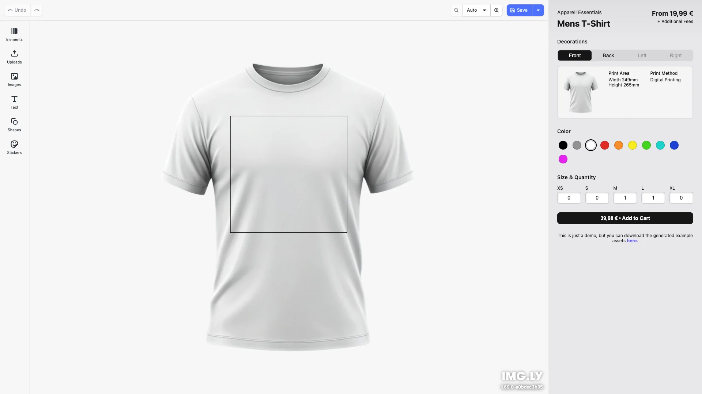

# T-Shirt Designer — Spryker Integration Reference

A customized fork of IMG.LY's [CE.SDK](https://img.ly/creative-sdk) t-shirt
designer, wrapped in a storefront-styled product detail page (Louis.de look &
feel) and wired up as a **Spryker** product configurator.

It runs standalone in the browser (no Spryker needed) and, when launched with a
Spryker context, posts the design back to the Glue Storefront API as a
`productConfigurationInstance`.

> **📐 Architecture:** see **[SPRYKER_INTEGRATION.md](./SPRYKER_INTEGRATION.md)**
> for how CE.SDK plugs into the Spryker architecture — the flow diagram, the
> front/back wire contract, the component map, and what is stubbed.

## Quick start

```bash
npm install
cp .env.example .env   # put your CE.SDK license key in VITE_CESDK_LICENSE
npm run dev            # http://localhost:5173  (standalone demo; add-to-cart = alert)
```

> **License behavior:** without a key the editor runs in evaluation mode with a
> watermark — fine for trying the demo. An **expired or invalid** key fails
> hard ("license expired" in the console, editor does not load); fix or remove
> the key in `.env`. Get a trial key at https://img.ly/forms/free-trial.

Embedded (Spryker configurator) mode activates automatically when opened with a
SKU + Glue base URL:

```
http://localhost:5173/?sku=001_25904006&quantity=1&glueBaseUrl=https://glue.eu.spryker.local&anonymousId=demo-anon-1&returnUrl=https://yves.eu.spryker.local/cart
```

### What's customized here

- **`src/spryker/`** — Spryker integration adapter (session parsing, configuration
  builder, Glue client). See [SPRYKER_INTEGRATION.md](./SPRYKER_INTEGRATION.md).
- **`src/app/`** — Louis.de-style PDP chrome (`StoreHeader`, `Breadcrumb`,
  `ProductInfo`, `FooterTabs`) around the CE.SDK editor; product identity in
  `src/app/product-catalog.ts`.

The backend half (server-side pricing, OMS command, state machine, import CSV)
lives in the parent Spryker project under `src/Pyz/…` and `config/Zed/oms/…` —
also mapped in [SPRYKER_INTEGRATION.md](./SPRYKER_INTEGRATION.md).

To test the add-to-cart wire contract without a running Spryker instance:

```bash
npm run mock:glue   # mock Glue API on http://localhost:9000
```

---

## Upstream starter kit

The sections below are from the original IMG.LY starter kit.

<p>
  <a href="https://img.ly/docs/cesdk/js/starterkits/t-shirt-designer-jwinqr/">Documentation</a>
</p>



This app began as [`imgly/starterkit-t-shirt-designer-react-web`](https://github.com/imgly/starterkit-t-shirt-designer-react-web)
and is vendored into this Spryker project — there is nothing separate to clone.

## Getting Started

### Download Assets (optional — self-hosting)

CE.SDK needs engine assets (fonts, icons, UI elements). **This app loads them
from the IMG.LY CDN by default** — no download needed for development. To
self-host them instead (recommended for production), download the bundle into
`public/` and set `baseURL: '/assets'` in the CE.SDK config (`src/index.tsx`).
The bundle version must match the installed `@cesdk/cesdk-js` version:

```bash
curl -O https://cdn.img.ly/packages/imgly/cesdk-js/1.77.0/imgly-assets.zip
unzip imgly-assets.zip -d public/
rm imgly-assets.zip
```

### Run the Development Server

```bash
npm run dev
```

Open `http://localhost:5173` in your browser.

## Configuration

### T-Shirt Product

The product identity (label, prices, print areas, mockup images, colors,
sizes) is configured in `src/app/product-catalog.ts`:

```typescript
export const PRODUCT_SAMPLES: ProductConfig[] = [
  {
    id: 'tshirt',
    label: 'TECHSTAR ARCH',
    brand: 'alpinestars',
    designUnit: 'Inch',
    unitPrice: 39.95,        // display only — Spryker prices server-side
    areas: [
      { id: 'front', label: 'Front', pageSize: { width: 20, height: 20 }, mockup: {/* … */} },
      { id: 'back',  label: 'Back',  pageSize: { width: 20, height: 20 }, mockup: {/* … */} }
    ],
    colors: [/* 10 color options */],
    sizes: [/* XS – L */]
  }
];
```

### Theming

```typescript
cesdk.ui.setTheme('dark'); // 'light' | 'dark' | 'system'
```

See [Theming](https://img.ly/docs/cesdk/web/ui-styling/theming/) for custom color schemes and styling.

### Localization

```typescript
cesdk.i18n.setTranslations({
  de: { 'common.save': 'Speichern' }
});
cesdk.i18n.setLocale('de');
```

See [Localization](https://img.ly/docs/cesdk/web/ui-styling/localization/) for supported languages and translation keys.

## Architecture

```
src/
├── app/                          # Louis.de-style PDP chrome + product logic
│   ├── App.tsx                       # Orchestrates editor, product state, add-to-cart
│   ├── product-catalog.ts            # Product identity (areas, colors, prices)
│   ├── utils/product.ts              # Scene setup + print-asset download helpers
│   └── …                             # UI components (StoreHeader, ProductInfo, …)
├── imgly/                        # Product-agnostic CE.SDK layer
│   ├── config/
│   │   ├── actions.ts                # Export/import actions
│   │   ├── features.ts               # Feature toggles
│   │   ├── i18n.ts                   # Translations
│   │   ├── plugin.ts                 # Main configuration plugin
│   │   ├── settings.ts               # Engine settings
│   │   └── ui/                       # Dock, inspector bar, panels, canvas
│   ├── plugins/
│   │   └── product-backdrop.ts       # Mockup backdrops + product.* actions
│   ├── index.ts                  # Editor initialization function
│   └── types.ts                  # TypeScript type definitions
├── spryker/                      # Spryker integration adapter (the reference part)
│   ├── types.ts                      # Wire contract (productConfigurationInstance)
│   ├── session.ts                    # Launch-context parsing (?sku=…&glueBaseUrl=…)
│   ├── productConfiguration.ts       # Scene → configuration + print-asset export
│   └── glueClient.ts                 # POST /guest-cart-items
└── index.tsx                     # Application entry point (CE.SDK config + license)
```

## Key Capabilities

- **Print Area Editing** – Front and back print areas
- **Color Customization** – 10 color options with real-time preview
- **Size Selection** – XS to XL with quantity counters
- **Real-time Mockup** – See designs on product mockups
- **E-commerce Cart** – Add to cart via the Spryker Glue API; the price is
  computed server-side from the configuration (standalone demo: alert)
- **Export** – PDF and PNG export for all areas

## Prerequisites

- **Node.js v20+** with npm – [Download](https://nodejs.org/)
- **Supported browsers** – Chrome 114+, Edge 114+, Firefox 115+, Safari 15.6+

## Troubleshooting

| Issue | Solution |
|-------|----------|
| Editor doesn't load | Verify assets are accessible at `baseURL` |
| Editor doesn't load, console says "license … expired/invalid" | The key in `.env` is expired or wrong — replace it (or remove it to run watermarked in evaluation mode) |
| Mockups don't appear | Check `public/assets/products/tshirt/` directory |
| Watermark appears | Add your license key (`VITE_CESDK_LICENSE` in `.env`) |

## Documentation

For complete integration guides and API reference, visit the [T-Shirt Designer Documentation](https://img.ly/docs/cesdk/starterkits/t-shirt-designer/).

## License

This project is licensed under the MIT License - see the [LICENSE](LICENSE) file for details.

---

<p align="center">Built with <a href="https://img.ly/creative-sdk?utm_source=github&utm_medium=project&utm_campaign=starterkit-t-shirt-designer">CE.SDK</a> by <a href="https://img.ly?utm_source=github&utm_medium=project&utm_campaign=starterkit-t-shirt-designer">IMG.LY</a></p>
