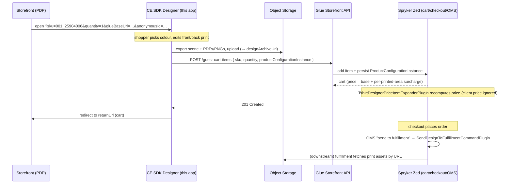

# CE.SDK × Spryker — T-Shirt Designer Integration (Reference Sketch)

How the IMG.LY **CreativeEditor SDK** (CE.SDK) t-shirt designer plugs into the
**Spryker Commerce OS** as a custom **product configurator**. This is a wiring
sketch and an architecture reference — not a runnable backend. It shows where
each piece lives, the contract between front and back end, and what remains
stubbed.

> TL;DR — A configurable SKU in Spryker delegates "how do I build this product?"
> to an external app. Here that app is the CE.SDK designer. The designer returns
> a `productConfigurationInstance` (a JSON description of the design); Spryker
> carries it through cart → checkout → order, recomputes the price server-side,
> and hands the print assets to fulfillment.

---

## 1. The Spryker concept: product configurators

Spryker products can be marked **configurable**. A configurable concrete product
is mapped to a **configurator key** in the product-configuration import:

```
# data/import/common/common/product_configuration.csv
concrete_sku,configurator_key,is_complete,default_configuration,default_display_data
001_25904006,TSHIRT_DESIGNER,0,,
002_25904004,TSHIRT_DESIGNER,0,,
```

When a shopper configures such a product, Spryker hands off to the configurator
identified by that key, and receives back a **`ProductConfigurationInstance`**:

| Field             | Meaning                                                       |
| ----------------- | ------------------------------------------------------------ |
| `configuratorKey` | `TSHIRT_DESIGNER` — which configurator produced this         |
| `isComplete`      | May this item be checked out?                                |
| `configuration`   | JSON — the **source of truth** (drives price + fulfillment)  |
| `displayData`     | JSON — human-readable summary for cart/order line display    |

That instance is the single object that travels with the cart item everywhere.

---

## 2. Two integration patterns (and which this uses)

Spryker supports two ways to drive an external configurator:

| Pattern | Handshake | Best for |
| ------- | --------- | -------- |
| **Classic Yves gateway** | Browser redirect to the configurator with a signed (CRC-hashed) request; configurator POSTs back to `ProductConfiguratorGatewayPage`. Strategy plugins (`ProductDetailPage`/`Cart`/`Wishlist`) build the request and handle the response. | Server-rendered (Twig) storefronts |
| **Headless Glue API** ← *this reference* | Designer is a SPA opened with the SKU/context; on add-to-cart it POSTs the `productConfigurationInstance` directly to the **Glue Storefront API**. No CRC handshake. | SPA / decoupled storefronts, modern UX |

This reference targets the **headless Glue** path — the React designer posts
the productConfigurationInstance straight to the Glue Storefront API. The
classic gateway wiring already exists in the repo
(`ProductConfiguratorGatewayPageDependencyProvider`) if you prefer that path.

> **Trust model:** in the headless flow there is no CRC handshake, and the
> stock Glue module even accepts client-sent `prices` on the instance. This
> reference therefore recomputes the price in Zed on every cart change and
> overwrites whatever the client sent — see §7.

---

## 3. End-to-end flow



---

## 4. The wire contract

`configuration` (the JSON inside `productConfigurationInstance.configuration`)
is the shared contract. **Frontend writes it; backend reads it.** Keep both
sides in sync.

```jsonc
{
  "color": "white",
  "areas": [
    { "id": "front", "printed": true },
    { "id": "back",  "printed": false }
  ],
  "designArchiveUrl": "https://storage.example.com/designs/abc123.zip"
}
```

- **Price** depends on `areas[].printed` →
  `TshirtDesignerPriceItemExpanderPlugin::countPrintedAreas()` (Zed).
- **Fulfillment** depends on `designArchiveUrl`, `color`, `areas` →
  `SendDesignToFulfillmentCommandPlugin::run()`.
- **Deliberately out of scope:** variant selection (size). In a real shop the
  chosen size maps to a different concrete SKU *before* the designer is
  launched; it is not part of the design configuration.

The TypeScript type and the PHP plugin are two ends of this one contract —
`src/spryker/types.ts` documents it on the frontend side.

---

## 5. Component map

### Frontend — the designer app (this repo: `t-shirt-designer/`)

| File | Responsibility |
| ---- | -------------- |
| `src/spryker/types.ts` | The wire contract: session + `productConfigurationInstance` shapes. |
| `src/spryker/session.ts` | Parse the launch context (`?sku=…&glueBaseUrl=…`). Returns `null` when standalone. |
| `src/spryker/productConfiguration.ts` | Inspect the CE.SDK scene → printed-area detection (by block kind), print-asset export (PDFs + thumbnails + scene archive), upload (**stubbed**), build the instance. |
| `src/spryker/glueClient.ts` | `POST {glueBaseUrl}/guest-cart-items` with the configured item. |
| `src/app/App.tsx` | `handleAddToCart`: if embedded → build instance + Glue POST + redirect; else demo alert. |
| `mock-glue-server.mjs` | Mock Glue endpoint (`npm run mock:glue`) to validate the wire contract without Spryker. |

### Backend — Spryker project (`src/Pyz/…`, already in this repo)

| File | Responsibility |
| ---- | -------------- |
| `data/import/common/common/product_configuration.csv` | Marks the two SKUs as `TSHIRT_DESIGNER` configurable. |
| `src/Pyz/Zed/ProductConfiguration/Communication/Plugin/Cart/TshirtDesignerPriceItemExpanderPlugin.php` | **Authoritative price** from `configuration` (base + per-printed-area surcharge, VAT) — overwrites `instance.prices` on every cart change in Zed. |
| `src/Pyz/Zed/Cart/CartDependencyProvider.php` | Registers the price item expander (before the product-configuration group-key expander). |
| `src/Pyz/Zed/Oms/Communication/Plugin/Oms/Command/SendDesignToFulfillmentCommandPlugin.php` | OMS command: forward print-asset **URLs** (not blobs) to fulfillment. |
| `src/Pyz/Zed/Oms/OmsDependencyProvider.php` | Registers the OMS command as `TshirtDesigner/SendToFulfillment`. |
| `config/Zed/oms/TshirtDesignerFulfillment01.xml` | State-machine fragment: `paid → sent to fulfillment → in production → shipped`. |
| `src/Pyz/Glue/ProductConfigurationsRestApi/…` (+ `spryker/product-configurations-rest-api` in composer) | Lets the Glue cart-item endpoint accept `productConfigurationInstance`. |

---

## 6. The integration seams (where you actually plug in)

1. **Mark products configurable** — the import CSV (done).
2. **Launch the designer** — point Spryker's configurator endpoint for
   `TSHIRT_DESIGNER` at this app's host and pass `sku`, `quantity`,
   `glueBaseUrl`, `anonymousId`, `returnUrl`. `anonymousId` is effectively
   required — the Glue guest-cart endpoints reject requests without the
   `X-Anonymous-Customer-Unique-Id` header. In the demo deploy the single
   configurator host is set via `SPRYKER_PRODUCT_CONFIGURATOR_HOST`
   (`deploy.dev.yml` points it at the Vite dev server, `localhost:5173`); for
   multiple configurators, route by `configurator_key`.
3. **Accept the configuration** — Glue (`product-configurations-rest-api`)
   already maps `productConfigurationInstance` onto the cart item. The
   designer runs on its own origin, so allow it via
   `SPRYKER_GLUE_APPLICATION_CORS_ALLOW_ORIGIN`.
4. **Price it** — the Zed cart item expander (done, see §7).
5. **Fulfill it** — the OMS command + state machine (done); merge the
   `send to fulfillment` step into the process assigned to these SKUs.

---

## 7. Pricing model

Client price is **untrusted** (the SPA talks to Glue directly, no CRC
handshake), so the server recomputes it from the configuration:

```
gross = BASE (2995¢)  +  printedAreaCount × SURCHARGE (500¢)
net   = round(gross / 1.19)        # 19% VAT backed out
```

How the price flows through Spryker's stock wiring (all of it already
registered in the demo shop):

1. A configured item's price lives in `ProductConfigurationInstance::prices`.
   In the stock headless flow those would come **from the client's POST** —
   which is exactly what must not be trusted.
2. **`TshirtDesignerPriceItemExpanderPlugin`** (this reference, registered in
   `Pyz\Zed\Cart\CartDependencyProvider::getExpanderPlugins()`) runs on every
   cart change in Zed and **overwrites** `instance.prices` with the amounts
   computed from the configuration JSON. It runs before
   `ProductConfigurationGroupKeyItemExpanderPlugin`, which hashes the instance
   (prices included) into the item group key.
3. `ProductConfigurationPriceProductExpanderPlugin` (core, PriceCartConnector)
   merges `instance.prices` into the price-product collection during
   recalculation, and `ProductConfigurationPriceProductFilterPlugin` (core,
   Service `PriceProduct`) selects them via the price dimension's
   configuration hash.

The price constants live **only** in the PHP plugin. The price shown inside
the designer is a static demo price — reflecting the surcharge in the UI is
a storefront concern and out of scope for this reference.

> **Verification status:** the plugin wiring follows the mechanism above as
> implemented in `spryker/product-configuration`(-`cart`) at the versions
> pinned in `composer.lock`; it has not yet been exercised against a running
> instance. Verify end-to-end (add to cart via Glue → check cart totals) when
> you boot the full environment.

---

## 8. What is stubbed (to make it runnable)

- **Asset upload** — `exportAndUploadDesign()` renders the full print bundle
  (per-area PDFs + thumbnails + scene archive) but returns `null` instead of
  uploading. Wire it to S3/your DAM and return the URL → `designArchiveUrl`.
  Once real, gate `isComplete` on upload success — it is the checkout gate.
- **Auth & cart lifecycle** — `glueClient` uses a guest cart with an anonymous
  id; add OAuth for logged-in customers, CSRF, and real error handling.
- **Printed-area detection** — `collectPrintedAreas()` counts page children
  that are not backdrop blocks (identified by block kind); tighten to your
  scene structure if your designer adds other non-design blocks to pages.
- **Fulfillment dispatch** — `SendDesignToFulfillmentCommandPlugin` logs via
  `error_log`; replace with your print MIS/fulfillment API call (idempotent).
- **Variant selection (size)** — intentionally not part of the configuration;
  in a real shop the size picker maps to a concrete SKU before launch.
- **License** — set `VITE_CESDK_LICENSE` (see `.env.example`) to remove the
  CE.SDK watermark.

---

## 9. Running the designer standalone

```bash
npm install
npm run dev   # http://localhost:5173  (no Spryker needed; demo add-to-cart = alert)
```

Embedded mode activates automatically when opened with `?sku=…&glueBaseUrl=…`.
```
http://localhost:5173/?sku=001_25904006&quantity=1&glueBaseUrl=https://glue.eu.spryker.local&anonymousId=demo-anon-1&returnUrl=https://yves.eu.spryker.local/cart
```

To validate the wire contract without booting Spryker, run the bundled mock
Glue endpoint and point `glueBaseUrl` at it:

```bash
npm run mock:glue   # http://localhost:9000, logs every received instance
```
```
http://localhost:5173/?sku=001_25904006&quantity=1&glueBaseUrl=http://localhost:9000&anonymousId=dev-1
```
